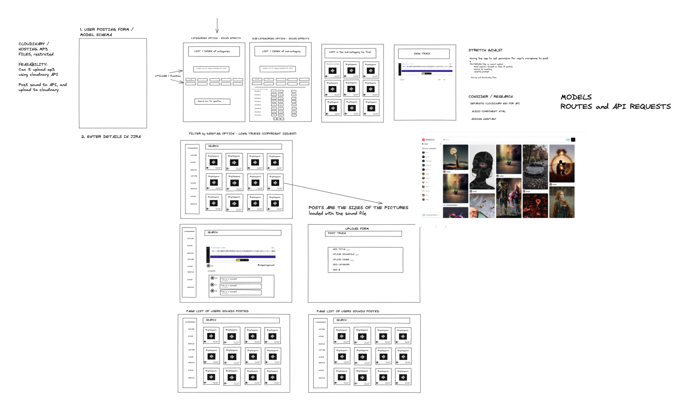
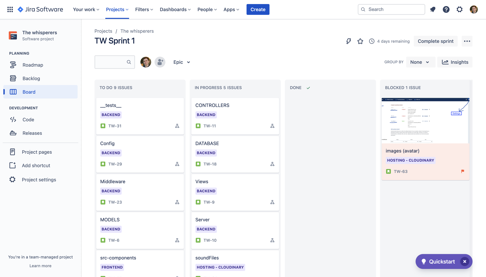
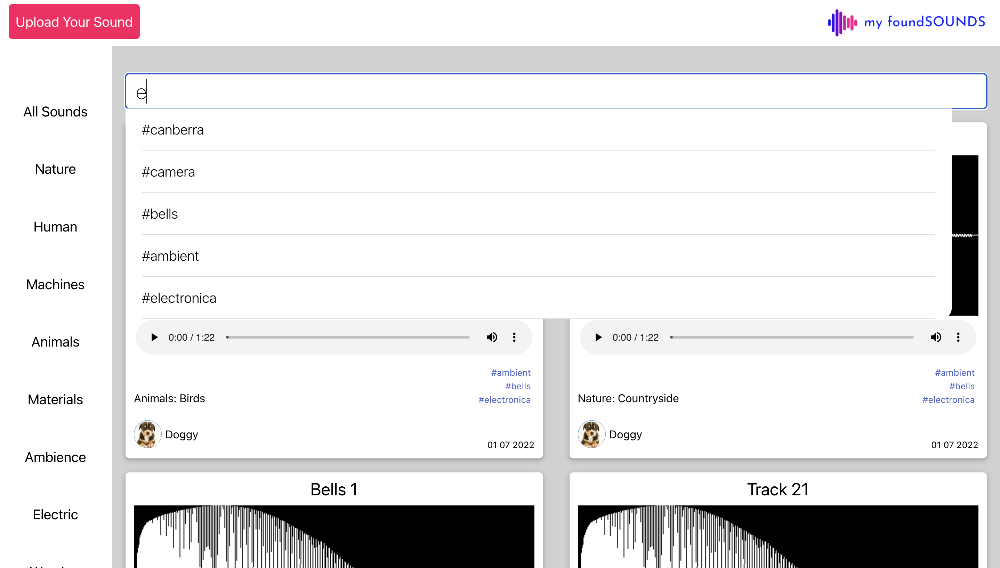
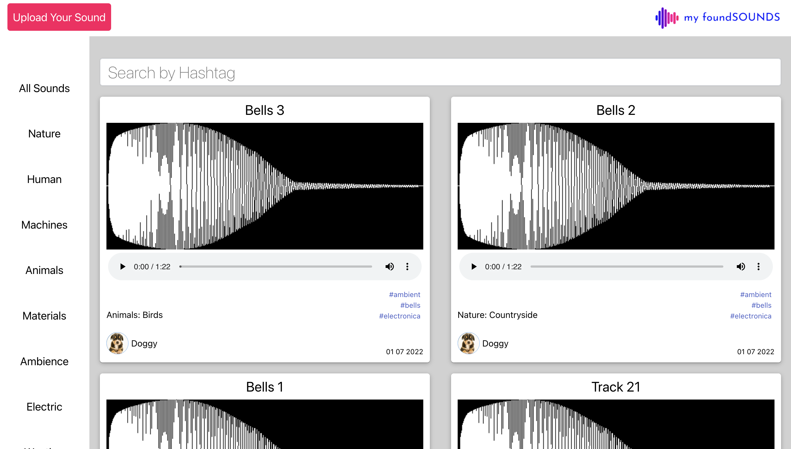
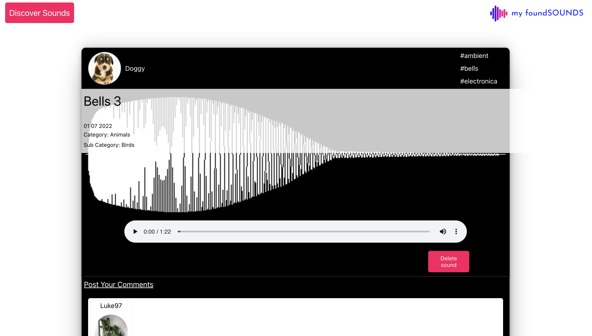

## My Found Sounds MERN Group project

Link to live site https://myfoundsounds.netlify.app/
Login credentials
Please feel free to use the below credentials to login when viewing the project
Email - portfoliouser@myfoundsounds.com
Password - Portfolio1!


### Project overview
This project involved building a full stack app using the MERN stack. Our project was a social media site based around audio. The site allows users to upload sounds from their devices and search for and listen to other users' sounds. For this project, we created our back-end API using MongoDb and Express along with utilising the Cloudinary API for audio file storage. To aid the development of the project, our group utilised Jira and scrum working to plan the project, assign tasks and track progress through the two one-week sprints.

### Technologies Used
- HTML
- CSS/Scss
- Javascript
- React
- MongoDb
- Express.js
- JIRA

### Project Brief
- Work in a team, using git to code collaboratively.
- Build a full-stack application by making your own backend and your own front-end
- Use an Express API to serve your data from a Mongo database
- Consume your API with a separate front-end built with React
- Be a complete product which most likely means multiple relationships and CRUD functionality for at least a couple of models
- Implement thoughtful user stories/wireframes that are significant enough to help you know which features are core MVP and which you can cut
- Have a visually impressive design
- Have automated tests for at least one RESTful resource on the back-end.

### Planning, whiteboarding and project management
Once we had settled on an idea for our project we worked collaboratively to create a wireframe for our project using excalidraw. This allowed us to see how our app would look and give us a better understanding of what would need to be done to create this and help inform our timeline, MVP and stretch goals.
</img>

For this project we used JIRA as a project management tool. At the beginning of the project we worked out what individual tasks needed to be done to build our project and set out a timeline for the duration of the two week project. We then divided the tasks into two one week sprints creating epics and stories.

</img>
</img>

We decided to begin the project working together to create the essential backend functionality together as a group as well as to set up the front end structure. We divided the rest of the tasks between different members of the group to work on separately. During the rest of the project we worked individually on our assigned JIRA tickets as well having pair/group programming and debugging sessions. This was an effective working method as it allowed us to work efficiently by specisiling on an element of the project but also allowing us to understand others work and allowed us to debug problems efficiently.

Throughout the project we used our JIRA for assigning tasks, Keeping track of our progress on the JIRA board leaving comments on stories with explanations and updates. Along with Using JIRA we also had a daily stand up on zoom to update the group on the work we had done, things we were struggling with and bugs that had been noticed. We stayed in contact between sessions on Slack updating the other members on work we have been doing. This allowed us to keep track of what was going on, plan our time effectively and support each other.

### Creating the Backend API
This was our 3rd coding project however was the first one where we would be building a backend. Due to the importance of the backend we worked collaboratively to create the core elements of the backend. We started by creating the core routes for api these being the sound endpoints and controllers. This was the backbone of the project and so we spent time working together to ensure that it was logically structured and that all of the required information was included in the model.
We also spent time as a group working on the backend for user registration and login. The user aspect of our project was very important as with the social media approach we had taken we wanted uploaded sounds to match to users. We also wanted to ensure that only users who were registered and logged in could perform certain functions therefore we placed these functions such as uploading sounds, deleting sounds and commenting within secure routes.

### Challenge one - Hashtags
One of the features which I was responsible for creating was the hashtag search functionality. We decided that as our project was a social media site that we should give users the ability to search for sounds more specifically using hashtags. This presented a number of challenges.
Firstly the create sound form needed for users to input multiple hashtags and for those to be stored correctly in the API. The solution I used was by having users enter hashtags in a comma separated list which when submitted would be split and stored as an array in the sounds object. One of the issues I faced was getting this to work alongside our current input function without it affecting other fields. To make this work as needed, place a conditional statement within the onchange function.

```js 
[event.target.name]: event.target.name === "hashtag" ? event.target.value.replace(" ", "").split(",") : event.target.value
```

The second step in creating this was creating an autocomplete search bar which when the users typed in would display a list of hashtags and when clicked on would redirect them to a results page displaying all items which matched these. To create this functionally I first made a new API endpoint specifically for hashtags which allowed for get and post. The posting of hashtags to this endpoint had to happen when the user submitted the upload sound form at the sametime the hashtags were added to the main sound object. However the data needed to be submitted in a different format to the hashtag data endpoint. The Sound endpoint had hashtags submitted as an array however i for this endpoint I wanted the hashtag to be submitted as seperate objects. 

``` js 
 const hashArray = formData.hashtag
      const hashobjects = hashArray.map((tag, index) => ({ hashtag: tag, index: index + 1 }));
      const { hashdata }  = await axios.post('/api/hashtags', hashobjects)
      console.log(hashdata)
```

I wrote the above function which maps through the hashtag array and breaks them down into objects with two keys and then posts them to the hastag API. 

``` js 
async function getHashtag(req, res) {
  try {
    const querys = req.query.hashtag
    console.log(querys)
    const matching = await Hashtag.find({ "hashtag": { $regex: querys } } )
    console.log(matching)
    res.json(matching)
    
  } catch (err) {
    res.status(500).send({ message: "We had problems handling your request on our side 😖. Please try again later." })
  }
}
```

### challenge two - All sounds page and working categories filter
Another aspect of the project I was assigned was the creation of the All sounds page as well as setting up the category filter function.

### Screenshots of Deployed Project
clockwise hashtag autocomplete search bar, all sounds page , login page, individual sound page 
</img>
</img>
</img>
</img>
### Lessons Learnt
During the project I learnt a number of things and was able to improve upon a number of skills
- I learnt the importance of planning and communication when working in a development team
- This project greatly improved my debugging skills by giving me the chance to debug other team members code
- I learnt about the importance of consistency and organising code in a easy to understand and easy to maintain way

### possible future developments
- Adding a like function with the ability to view all the songs you have liked.
- Allowing users to follow others with potential for timeline feature like seen on social media
- Fully responsive design

### created with
- Teresa Morini -- https://github.com/tjmcodes
- Laleh Shahidi -- https://github.com/Laleh-S
- Kazimierz Jankowski -- https://github.com/donnysnarko


  
